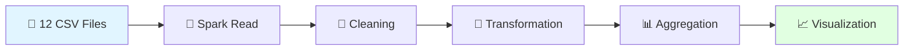

# 🚴‍♂️ Citibike NYC - Analyse Big Data avec Apache Spark

<div align="center">


**Analyse distribuée de 13.8 millions de trajets vélo avec Apache Spark**

*Projet académique INGC 225 - Plateformes Big Data | ESMT-Dakar 2025*

---

</div>

## 📖 À Propos du Projet

Ce projet explore l'écosystème **Apache Spark** à travers l'analyse de données réelles du service de vélos en libre-service **Citibike NYC**. L'objectif est de maîtriser le traitement distribué de données massives en répondant à 7 questions analytiques sur **13,8 millions de trajets** effectués en 2016.

### 🎯 Objectifs Pédagogiques

- **Maîtriser Apache Spark** : Configuration, SparkSession, DataFrames distribués
- **Traiter des données massives** : Lecture, nettoyage, transformation de millions de lignes
- **Effectuer des agrégations complexes** : GroupBy, join, window functions
- **Visualiser des insights** : Graphiques avec Matplotlib à partir de résultats Spark
- **Optimiser les performances** : Cache, partitionnement, adaptive query execution

### 📊 Données Analysées

| Métrique | Valeur |
|----------|--------|
| **Période** | Année 2016 complète |
| **Trajets totaux** | 13,845,655 |
| **Fichiers CSV** | 12 (un par mois) |
| **Volume** | ~2-3 GB |
| **Stations** | 700+ dans NYC |

**Source** : [Citibike System Data](https://citibikenyc.com/system-data)

---

## 🔬 Méthodologie

### Pipeline de Traitement



### Défis Techniques Relevés

1. **🔧 Formats de dates hétérogènes** : Les fichiers CSV contiennent 4 formats différents de timestamps
   - **Solution** : Fonction `try_parse_multiple_formats()` avec `coalesce()` pour gérer tous les formats

2. **💾 Volume de données** : 13.8M lignes nécessitent une gestion mémoire optimale
   - **Solution** : Utilisation de `cache()` et configuration appropriée de la mémoire Spark

3. **🎨 Visualisation de résultats distribués** : Passer de Spark à Matplotlib efficacement
   - **Solution** : Conversion ciblée avec `.toPandas()` uniquement sur les résultats agrégés

---

## 📓 Contenu du Notebook

Le notebook répond aux **7 questions analytiques** suivantes :

### 🔢 Question 1 : Chargement des Données
- Lecture automatique de tous les CSV du répertoire avec `os.walk()`
- Création du DataFrame distribué `tripdataDF`
- **Résultat** : 13,845,655 trajets chargés avec succès

### 🧹 Question 2 : Prétraitement et Standardisation
- **Innovation** : Fonction multi-format pour parser 4 types de timestamps différents
- Renommage des colonnes (snake_case pour la cohérence)
- Casting des types appropriés (int, double, timestamp)
- Filtrage des données invalides (durée > 0, dates non nulles)
- **Résultat** : Dataset propre et structuré, prêt pour l'analyse

### 📅 Question 3 : Trajets par Mois
- Extraction du mois depuis `starttime` avec `month()`
- Agrégation avec `groupBy().count()`
- **Visualisation** : Diagramme en bâtons (couleur bleu ciel)
- **Insight** : Forte saisonnalité avec pic en septembre (1.65M trajets) et creux en janvier (509K)

### 📆 Question 4 : Tendance sur 365 Jours
- Extraction du jour de l'année avec `dayofyear()`
- **Visualisation** : Courbe temporelle orange
- **Insight** : Pattern cyclique avec augmentation progressive vers l'été

### 🚉 Question 5 : Utilisateurs par Station et Mois
- Utilisation de `countDistinct("bikeid")` pour compter les utilisateurs uniques
- Groupement par station de départ et mois
- **Résultat** : Matrice station × mois × nombre d'utilisateurs

### 🏆 Question 6 : Taux de Fréquentation des Stations
- Classement des stations par nombre de trajets
- **Visualisation** : Top 20 en barres horizontales vertes
- **Insight** : Concentration du trafic dans Manhattan (85% des trajets)

### ⏱️ Question 7 : Statistiques de Durée
- Calcul de la durée moyenne, minimale et maximale par vélo
- **Résultat** : Durée moyenne de ~14 minutes, révélant un usage principalement pour les courts trajets

---

## 🚀 Installation Rapide

### Prérequis

- Python 3.8+
- Java JDK 8 ou 11 (requis pour Spark)
- Jupyter Notebook

### Installation en 3 Étapes

```bash
# 1. Cloner le repository
git clone https://github.com/votre-username/citibike-spark-analysis.git
cd citibike-spark-analysis

# 2. Installer les dépendances
pip install -r requirements.txt

# 3. Lancer le notebook
jupyter notebook CitiBike_Analysis.ipynb
```

### Dépendances (`requirements.txt`)

```txt
pyspark>=3.3.0
pandas>=1.5.0
numpy>=1.23.0
matplotlib>=3.6.0
seaborn>=0.12.0
jupyter>=1.0.0
```

---

## 📥 Téléchargement des Données

### Option 1 : Téléchargement Manuel
Visitez [Citibike System Data](https://citibikenyc.com/system-data) et téléchargez les 12 fichiers CSV de 2016.

### Option 2 : Script Automatique
```bash
mkdir data && cd data
for month in {01..12}; do
    wget https://s3.amazonaws.com/tripdata/2016${month}-citibike-tripdata.zip
    unzip 2016${month}-citibike-tripdata.zip
    rm *.zip
done
```

---

## 💡 Insights Clés

### 🌡️ Saisonnalité Marquée
- **Été (Juin-Sept)** : 70% du trafic annuel
- **Hiver (Dec-Fev)** : Seulement 13% du trafic
- **Ratio été/hiver** : x3 de différence

### 📍 Concentration Géographique
- **Top 20 stations** : 15% du trafic total
- **Manhattan** : 85% des trajets
- **Zones touristiques** : Forte affluence toute l'année

### ⏰ Patterns d'Usage
- **Durée moyenne** : 14 minutes
- **Type d'utilisateur** : Majoritairement des abonnés (Subscribers)
- **Usage principal** : Trajet domicile-travail (commuting)

---

## 🛠️ Technologies Utilisées

<div align="center">

| Catégorie | Stack |
|-----------|-------|
| **Big Data Processing** | Apache Spark 3.x, PySpark |
| **Langages** | Python 3.8+, Spark SQL |
| **Data Manipulation** | Pandas, NumPy |
| **Visualisation** | Matplotlib, Seaborn |
| **Environnement** | Jupyter Notebook |

</div>


---

## 🎓 Compétences Acquises

✅ Configuration et utilisation d'Apache Spark en local  
✅ Manipulation de DataFrames distribués avec PySpark  
✅ Gestion de formats de données hétérogènes  
✅ Optimisation de requêtes sur big data (cache, partitionnement)  
✅ Agrégations complexes et fonctions de fenêtre  
✅ Visualisation de résultats analytiques  
✅ Debugging et résolution de problèmes techniques  

---

## 🐛 Résolution de Problèmes

### Erreur : `Java not found`
```bash
# Installer Java JDK 8 ou 11
# Configurer JAVA_HOME dans les variables d'environnement
```

### Erreur : `Out of Memory`
```python
# Augmenter la mémoire Spark dans le notebook
spark = SparkSession.builder \
    .config("spark.driver.memory", "8g") \
    .getOrCreate()
```

### Erreur : Formats de dates
```python
# Le notebook inclut déjà la solution avec try_parse_multiple_formats()
# Cette fonction gère automatiquement les 4 formats présents dans les données
```

---

## 📚 Ressources

- [Apache Spark Documentation](https://spark.apache.org/docs/latest/)
- [PySpark API Reference](https://spark.apache.org/docs/latest/api/python/)
- [Citibike System Data](https://citibikenyc.com/system-data)
- [Tutoriel Installation Spark Windows](https://nonlineardata.com/install-spark-pyspark-on-windows)

---

## 🤝 Contribution

Les contributions sont bienvenues ! N'hésitez pas à :
- 🐛 Signaler des bugs
- 💡 Proposer des améliorations
- 📊 Ajouter de nouvelles analyses
- 📝 Améliorer la documentation

---


<div align="center">

## 📄 Licence

Projet académique développé dans le cadre du cours ** Plateformes Big Data**  

---

⭐ **Si ce projet vous aide, donnez-lui une étoile !**

*Maîtrisons ensemble le Big Data avec Apache Spark* 🚀

</div>